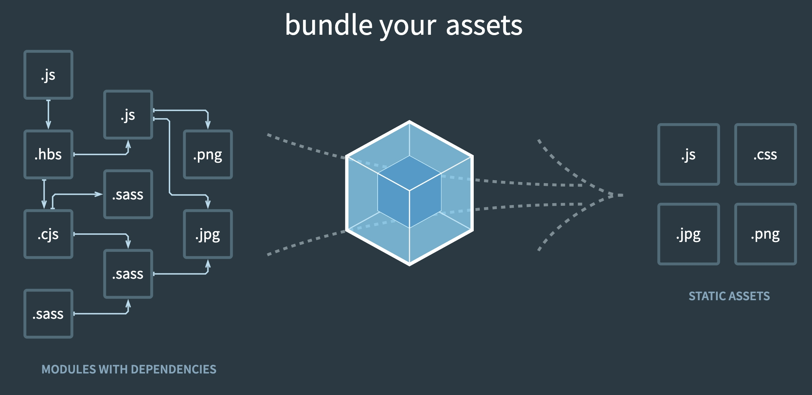
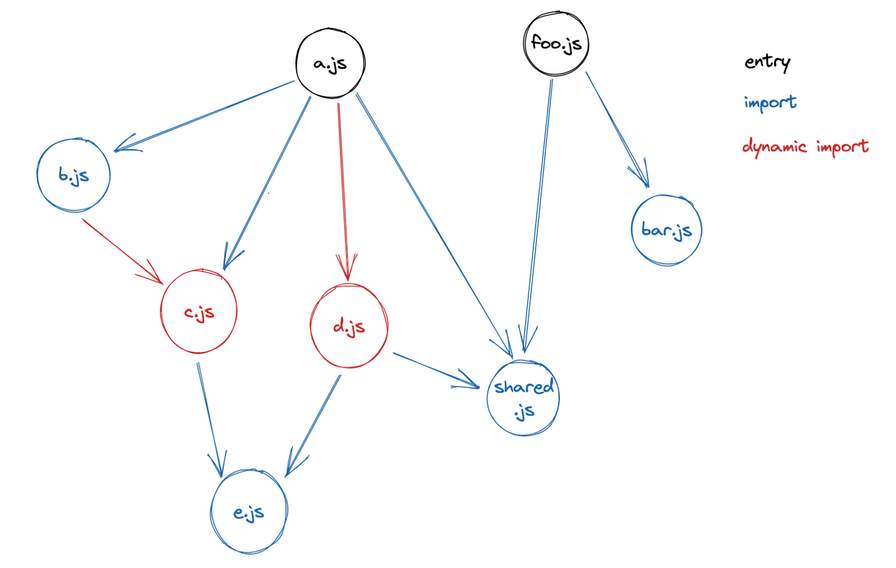
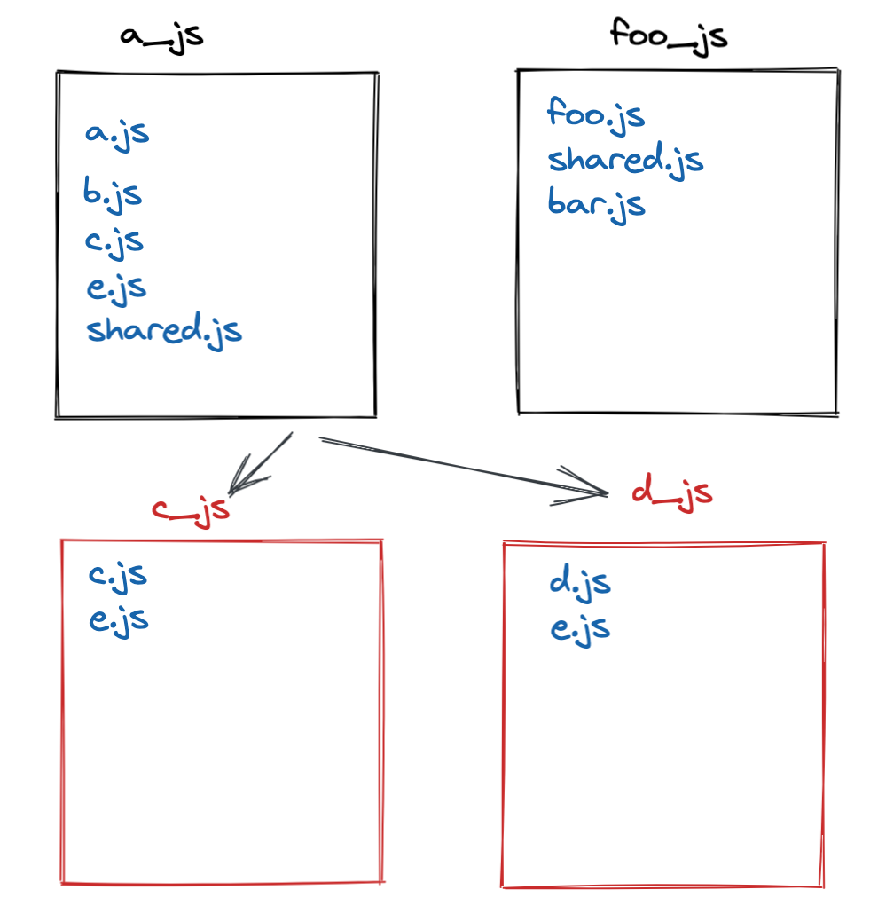

# 1. Code splitting and Bundle splitting

## 步骤一

### 准备
为了理解本期要讲解的主题，建议按照本节推荐的顺序先看下参考资料

- 了解 Webpack 的整体编译流程
  - [一文吃透 Webpack 核心原理](https://zhuanlan.zhihu.com/p/363928061)

- Bundle splitting 的意义
  - [The 100% correct way to split your chunks with Webpack](https://medium.com/hackernoon/the-100-correct-way-to-split-your-chunks-with-webpack-f8a9df5b7758)
  - [【译】使用 Webpack 拆包的 100% 正确的做法](https://zhuanlan.zhihu.com/p/372544036)

- 了解什么是 Code splitting 和 Bundle splitting 的区别
  - 阅读 [Webpack 中的 Code splitting 是什么？](https://bytedance.feishu.cn/docx/doxcnM4naM7kJh36NUYrXldZ8oc)
  - 阅读 [Survivejs - Code Splitting](https://survivejs.com/webpack/building/code-splitting/)
- 了解什么是 Bundle splitting？
  - 阅读 [Survivejs - Bundle Splitting](https://survivejs.com/webpack/building/bundle-splitting/)

### 核心问题
Webpack 是如何做 Code splitting 和 Bundle splitting 的？

### 本次活动录像

WIP

## 步骤二

### 广

从架构出发，我们可以把 Webpack 分为两个部分

- Core
  - Loader
- Plugin

Core 代表了 Webpack 的核心功能，覆盖了 Webpack 从解析资源到最终生成打包产物的过程。在这个过程中， Core 通过控制反转的设计，将大部分流程中逻辑暴露出来，从而更加灵活的以一种可插拔的方式去扩展 Core 的功能。

Webpack 设计了一套基于 [`tapable`](https://github.com/webpack/tapable) 的插件系统。其中 `tapable` 的作用是用于抽象插件的注册和执行方式，比如说有的插件按顺序执行，有的可以并行执行。

> 80% of webpack is made up of its own plugin system —— [Understanding webpack from the inside out
](https://www.youtube.com/watch?v=gEBUU6QfVzk)

本节会着重介绍下 Webpack 的 Core 部分。

#### Core

Webpack 的核心功能是是将各种类型的资源，包括图片、css、js等，转译、组合、拼接，最终生成打包产物。



这个过程核心完成了 内容转换 + 资源合并 两种功能，实现上包含三个阶段：

##### 初始化阶段：
1. 初始化参数：从配置文件、 配置对象、Shell 参数中读取，与默认配置结合得出最终的参数
2. 创建编译器对象：用上一步得到的参数创建 `Compiler` 对象
3. 初始化编译环境：包括注入内置插件、注册各种模块工厂、初始化 RuleSet 集合、加载配置的插件等
4. 开始编译：执行 `Compiler` 对象的 `run()` 方法
5. 确定入口：根据配置中的 `Entry` 找出所有的入口文件，调用 `compilation.addEntry()` 将 `Entry` 转换为 `Dependency` 对象
##### 构建阶段：
1. 编译模块(make)：根据 `Entry` 对应的 `Dependency` 创建 `Module` 对象，调用 `Loader` 将模块转译为标准 JS 内容，调用JS 解释器将内容转换为 AST 对象，从中找出该模块依赖的模块，再 递归 本步骤直到所有入口依赖的文件都经过了本步骤的处理
2. 完成模块编译：上一步递归处理所有能触达到的模块后，得到了每个模块被翻译后的内容以及它们之间的关系，构建出了 `ModuleGraph`
##### 生成阶段：
1. 输出资源(seal)：根据入口和模块之间的依赖关系(是否进行了动态引入)，进行 Code splitting Chunk，构建出 `ChunkGraph` 。根据用户的配置选择是否进行 Bundle splitting ，分割出更多的 `Chunk` 。 随后根据 `Chunk` 生成 `Asset`, 这步是可以修改输出内容的最后机会
2. 写入文件系统(emitAssets)：在生成 `Asset` 后，根据配置确定输出的路径和文件名，把 `Asset` 写入到文件系统

__总结下就是从 `ModuleGraph` 到 `ChunkGraph` 再到 `Assets` 的过程__。

#### Glossary

接下来，我们来介绍下，上述文章涉及到的一些关键字，更多可参见

###### `Module`

Webpack 内部所有资源都会以 `Module` 实例的方式存在，所有关于资源的操作、转译、合并都是以 `Module` 为基本单位进行的。

###### `ModuleGraph`

`ModuleGraph` 记录了所有 `Module` 的依赖关系

###### `Code splitting`

针对于将要打包的代码，我们基于入口模块和动态入口模块为分割点/`Module` 间的依赖关系，创建 Chunks 的流程，并将模块放入到其应属的 Chunk 中。 Chunks 的创建完全是根据入口模块和动态入口模块的数量来创建。

详细解析见 [Webpack 中的 Code splitting 是什么？](https://bytedance.feishu.cn/docx/doxcnM4naM7kJh36NUYrXldZ8oc)

###### `Bundle splitting`

**Bundle splitting** 是能让你通过配置项对产物进行任意分割的技术。其常见的用途有将依赖的第三方代码单独抽出来代码，以便进行缓存复用。

###### `Chunk`

`Chunk` 由 `Module` 组成， Webpack 会根据代码意图和配置将 `Module` 组装成 `Chunk` ， 在大部分情况下 `Chunk` 与 `Asset` 是一一对应的

###### `ChunkGraph`

`ChunkGraph` 记录了所有 `Chunk` 的依赖关系，这个关系表述为，若 A -> B ，则在加载 A Chunk 之前需要先加载 B 。


本节内容多摘抄于 [[万字总结] 一文吃透 Webpack 核心原理](https://zhuanlan.zhihu.com/p/363928061)

### 谈谈如何阅读代码

#### 做一个主动的阅读者

首先，我们要都同意这一点——你在意识清醒、思维敏捷的状态下从阅读中得到的收获，远比困倦或者醉醺醺的状态下来的多。换句话说，如果你想从阅读中得到更多收获，就一定要做到阅读时意识清醒、思维敏捷，即阅读时保持 **主动**。

#### 主动的核心

阅读时必须要能 **提出问题** ，并且在阅读中尝试去 **回答问题**

必须要提出的基本问题

1. 这段代码整体在干什么？
2. 这段代码细节在干什么？
3. 这段代码和你的核心问题有什么关系？

解决问题 1

- 用简短、精炼的话语总述本段代码
  - 依照顺寻和关联性列举代码中主要部分。梳理出代码的流程图，递归的应用本条规则到代码的各个部分，直到你觉得足够详细。

- 找出、确定作者的意图或想要解决的问题

解决问题 2

- 与作者对其关键字词的含义达成共识
- 通过找出代码中的变量名，函数名和注释来明白作者的意图

#### 理解阅读理解代码过程中的三类问题

- 缺乏知识（Lack of knowledge，对应长期记忆 long-term memory ， LTM）。指开发者缺乏基本的编程语言的知识，无法使用或理解基本的语法，而造成的困扰。
- 缺乏信息（Lack of information，对应短期记忆， short-term memory， STM）。指开发者缺乏程序要处理的问题领域信息的了解，而造成的困扰。
- 缺乏处理能力（Lack of processing power ，对应工作记忆，working memory，WM）。指开发者缺乏对整个编程执行过程的处理能力，而造成的困扰。

接下来，我们按照从易到难的顺序，解释下这些问题的含义和应对他们的方法

##### 缺乏知识

缺乏知识是说，你看代码的时候，看到一段代码是 `a.duration ??= 10;` ，你又不了解 `??=` 的意思，那自然就无法正确理解这段代码的含义。

不过，应对缺乏知识这个问题的方法很简单，查下语言的手册就行。

##### 缺乏处理能力

我们在阅读理解代码的过程，其实是将自己的大脑当成一个语言解释器去模拟执行代码的过程。你想理解一段代码，自然要了解这段代码的执行顺序。这个过程中的难点在于，有的程序采用的编程模型会和大脑擅长的线性思维冲突。

拿 Webpack 举例子的话， Webpack 内部的代码是基于 [`tapable`](https://github.com/webpack/tapable) 事件驱动 + callback 风格的编程模型。阅读代码的过程中充满着跳跃性，从上到下阅读代码过程并不对应着程序实际执行流程。我们需要使用多个方法来克服这个难点

- 多次反复阅读，培养对这段代码逻辑的熟悉程度
- 以函数为粒度，编写流程图，总结每个流程的大意
- 使用 Debugger ，通过打断点等方式去观察代码的实际执行流程

##### 缺乏信息

缺乏信息是在阅读代码过程中最容易出现的问题。原因是，我们接触的大部分代码都是为了处理某个领域的具体问题的，这就要求你在编程技能之外还要去掌握对应的 [领域知识](https://en.wikipedia.org/wiki/Domain_knowledge) 。

脱离上下文理解 `a = b + c` 只需要基础的数学知识，但是如果你了解到这段代码是从电压放大器的功能代码里摘出来的，你至少需要先知道电压放大器是什么，才能开始猜测这段代码想要表达的含义。

处理缺乏信息问题的方法

- 阅读相关领域的书籍或文章
- 寻找别人对这段代码的解读
- 阅读代码注释
- 假设，猜测，验证

#### 总结

无论应用什么技巧，代码阅读是个需要“硬啃”的活动，用力和用心去读才是最重要的。

### 深

### Code splitting 流程

**小技巧：善于使用代码块折叠，有助于你避免无关逻辑的干扰**

#### [初始化数据结构](https://github.com/webpack/webpack/blob/9fcaa243573005d6fdece9a3f8d89a0e8b399613/lib/Compilation.js#L2789-L2812)

- 初始化 `ChunkGraph`
- 冻结 `ModuleGraph`
- 触发 `optimizeDependencies` hook
- 触发 `afterOptimizeDependencies` hook

#### `optimizeDependencies` hook 是干嘛的？

我们正好借着 `optimizeDependencies` hook 来演示下如何理解它的含义

- 在 webpack 仓库里搜索，看看有哪些地方使用这个 hook

发现有这些插件使用这个 hook

- `FlagAllModulesAsUsedPlugin`
- `FlagDependencyUsagePlugin`
- `SideEffectsFlagPlugin`

从名字和使用的插件名来看，可以猜到是有关于优化依赖和 tree shaking 相关的钩子，接下来为了更加详细的理解这个 hook 的作用可以具体去看这些插件的代码，这里就不多做介绍了。后续的文章也会忽略和主线流程无关的 hook。

#### Webpack 的 Chunk 类型

- Code splitting 产生的 Chunk 类型

  - **Initial chunk** 根据用户配置的入口模块创建的 Chunk，负责加载 Webpack 的运行时和需要初始化加载的模块。

  - **Async chunk** 是由异步入口模块，即动态 import 引入的文件，产生的 Chunk，不包含 Webpack 的运行时代码，只负责加载模块。


###### 举个例子

我们由



生成了以下 Chunk



其中 `a_js` 和 `foo_js` 都属于 **Initial chunk** ， `c_js` 和 `d_js` 都属于 **Async chunk** 

Chunk 的类型会被 [`splitChunks.chunks`](https://webpack.js.org/plugins/split-chunks-plugin/#splitchunkschunks) 配置项感知，从而决定对那些 Chunk 类型进行分割。


- Bundle splitting 通过配置，可以对 Code splitting 阶段产生的 Chunk 进行任意的拆解，组合从而产生新的 Chunk ，我们暂时称呼这种 Chunk 为 **Normal chunks**

由 `SplitChunks` 插件拆解出来的 Chunk 遵循以下规则

- 如果拆解后生成的 `Normal chunk` 里的模块全部来自于 `Async chunk` ，那么这个 `Normal chunk` 也会被异步加载
- 如果拆解后生成的 `Normal chunk` 里的模块有部分自于 `Initial chunk` ，那么这个 `Normal chunk` 会先于 Initial chunk 加载


#### 什么是 `ChunkGroup`

`ChunkGroup` 的作用

- 用于表示同属于一个 `ChunkGroup` 的 `Chunk` 是可以并行加载的。
- 用于保留 Code splitting 阶段 `Chunk` 之间的关系
  - 用于 html plugin 来设置那些资源需要在初始化的时候加载

> At an entrypoint or an async splitpoint a single ChunkGroup is referenced, which means all contained Chunks in parallel. A Chunk can be referenced in multiple ChunkGroups.

参考自 [webpack 4: Code Splitting, chunk graph and the `splitChunks` optimization](https://medium.com/webpack/webpack-4-code-splitting-chunk-graph-and-the-splitchunks-optimization-be739a861366)

#### 创建 Entry chunks 和 `Entrypoint`

- [通过 `compilation#addChunk()` 方法，针对每一个入口项创建一个 Chunk](https://github.com/webpack/webpack/blob/9fcaa243573005d6fdece9a3f8d89a0e8b399613/lib/Compilation.js#L2815-L2817)
- 针对每一个入口项，创建继承了 `ChunkGroup` 的 `EntryPoint` 实例
  - 并和创建的 Entry chunk 关联起来

##### [`buildChunkGraph()`](https://github.com/webpack/webpack/blob/9fcaa243573005d6fdece9a3f8d89a0e8b399613/lib/buildChunkGraph.js#L1347)

一个典型的缺乏信息的问题，什么是 `Block` ？

`Module` 就是 `Block`

什么是 `DependenciesBlock`

什么是 `AsyncDependenciesBlock`

##### `visitModules()`

- 初始化一些基本的数据结构
- [根据 `EntryPoint` 和其模块生成 `QueueItem` 添加到  `queue` 里](https://github.com/webpack/webpack/blob/9fcaa243573005d6fdece9a3f8d89a0e8b399613/lib/buildChunkGraph.js#L334-L343)

- 提出问题

  - 什么时候 `chunkGroup.getNumberOfParents() > 0` 的条件会满足？
    - 我们从逻辑上推理，入口模块已经是打包的起始点，那么由入口模块派生出的 `EntryPoint` 怎么还可能会有 parents 呢？
    - 接下来，我来介绍下我是如何搞清楚这个问题的
    - 解决问题思路线条是：为了满足 `chunkGroup.getNumberOfParents() > 0` 的条件，`ChunkGroup` 一定会有 parent。那么这个 parent 如何加进来的呢？ 只要搞清楚在什么位置给 `ChunkGroup` 添加 parent ，整个脉络就行了。
    - 此处视频演示下，如何按照上述思路解决问题的
    - 对应着 Webpack 支持的入口之间进行依赖的功能，也就是 [dependOn](https://webpack.js.org/concepts/entry-points/#entrydescription-object) 属性

- 循环处理 `queue` 和 `queueConnect`

  - 调用 `processQueue()` 

  - 从 `queue` 里 `pop()` 出一个 `queueItem` 进行处理

    - [面对 `ADD_AND_ENTER_ENTRY_MODULE`](https://github.com/webpack/webpack/blob/9fcaa243573005d6fdece9a3f8d89a0e8b399613/lib/buildChunkGraph.js#L700)

      - 根据入口模块创建 `ChunkGraphModule` 并与 Initial chunk 链接到一起
      - 根据 Initial chunk 创建 `ChunkGraphChunk` 并与入口模块和 `Entrypoint` 链接到一起
      - 然后 fallback 到 `ADD_AND_ENTER_MODULE`

    - 面对 `ADD_AND_ENTER_MODULE`

      - 首先判断这个模块是不是已经在这个 Chunk 里了，是的话，跳过这次循环
      - 否则，将这个模块和 Chunk 链接到一起
      - 然后 fallback 到 `ENTER_MODULE`

    - 面对 `ENTER_MODULE`

      - 获取这个模块在当前 `ChunkGroup` 里的 pre-order 索引顺序

        - 如果不存在，则生成一个并记录

      - 尝试设置这个模块在 `ModuleGraph` 的 pre-order 索引顺序

        - 查看 `ModuleGraphModule#preOrderIndex` 是否有值，没值就设置
        - 往 `queue` 里推入以下 `QueueItem` ，用来记录何时离开这个模块，本质上是使用数组模拟栈，用栈对模块图同事进行 pre-order 和 post-order 遍历

        ```js
        // reuse queueItem
        queueItem.action = LEAVE_MODULE;
        queue.push(queueItem);
        ```

        - fallback 到 `PROCESS_BLOCK`

    - 面对 `PROCESS_BLOCK`

      - 调用 `extractBlockModules()` 获取当前 `Block`/`Module` 下的 `Block`/异步`Module`
        - `extractBlockModules()` 返回的是此 `Module` 异步引入的 `Module`
      - 遍历 `block#blocks` 中的每一项，并调用 [`iteratorBlock()`](https://github.com/webpack/webpack/blob/9fcaa243573005d6fdece9a3f8d89a0e8b399613/lib/buildChunkGraph.js#L398) 方法
        - `block#blocks` 存储的是异步入口模块
        - 针对每一个 `AsyncDependenciesBlock` 都创建一个 `ChunkGroup`
          - [并将这个 `ChunkGroup` 和这个 `block` 关联起来](https://github.com/webpack/webpack/blob/9fcaa243573005d6fdece9a3f8d89a0e8b399613/lib/buildChunkGraph.js#L443)

    - 面对 `PROCESS_ENTRY_BLOCK`

      - 略

    - 面对 `LEAVE_MODULE`

      - 设置模块在 `ChunkGroup` 的 post-order 索引顺序
      - 设置模块在 `ModuleGraph` 的 post-order 索引顺序

##### `connectChunkGroups()`

- 计算 `ChunkGroup` 之间的关系，并链接起来

##### `cleanupUnconnectedGroups()`

- 清理掉没有被链接的 `ChunkGroup`

我们得到一个未经任何优化，最基本的 `ChunkGraph`

- 我们得到的 `Chunk` 数量等于分割点模块的数量
- 每个 `ChunkGroup` 中都只包含一个 `Chunk`

### SplitChunks 插件介绍

参见

- https://webpack.js.org/plugins/split-chunks-plugin/
- [【译】使用 Webpack 拆包的 100% 正确的做法](https://zhuanlan.zhihu.com/p/372544036)

### Bundle splitting 流程

#### [准备阶段](https://github.com/webpack/webpack/blob/9fcaa243573005d6fdece9a3f8d89a0e8b399613/lib/optimize/SplitChunksPlugin.js#L793-L1182)

- 获取 `ChunkGraph`
- 获取 `ModuleGraph`
- 给每一个 `Chunk` 初始化一个索引
  - 索引使用的数据类型是 `Bigint`

#### 开始 splitting

- 遍历所有模块，通过 `getCacheGroups` 计算每一个 `Module` 符合的 `CacheGroupSource`

  ```typescript
  /**
   * @callback GetCacheGroups
   * @param {Module} module
   * @param {CacheGroupsContext} context
   * @returns {CacheGroupSource[]}
   */
  ```

  - [`getCacheGroups` 是由用户传入的 `splitChunks#cacheGroup` 的选项计算出来的](https://github.com/webpack/webpack/blob/9fcaa243573005d6fdece9a3f8d89a0e8b399613/lib/optimize/SplitChunksPlugin.js#L654-L657)
  -  [`CacheGroupSource`](https://github.com/webpack/webpack/blob/9fcaa243573005d6fdece9a3f8d89a0e8b399613/lib/optimize/SplitChunksPlugin.js#L55-L75) 是用来描述对应的 `CacheGroup` 的配置信息
    - 比如那些 `Module` 该进入这个 `CacheGroup`
    - 这个 `CacheGroup` 的名字
    - 最多分割成多少个 `Chunk` 等等

- [根据 `CacheGroupSource` 创建出 `CacheGroup` 对象](https://github.com/webpack/webpack/blob/9fcaa243573005d6fdece9a3f8d89a0e8b399613/lib/optimize/SplitChunksPlugin.js#L1187-L1189)

  - [获取当前这个模块所属的所有 `Chunk` ](https://github.com/webpack/webpack/blob/9fcaa243573005d6fdece9a3f8d89a0e8b399613/lib/optimize/SplitChunksPlugin.js#L1220-L1222)
  - 判断获得的 `Chunk` 数量是否小于 [`CacheGroup#minChunks`](https://webpack.js.org/plugins/split-chunks-plugin/#splitchunksminchunks)
    - 这个选项是用来限制，一个模块只有被 n 个 chunk 使用的时候，才能命中这条 `CacheGroup` ，小于的情况下，说明没命中，直接跳过
  - [对获得的 `Chunk` 进行通过 `cacheGroup.chunksFilter` 函数过滤一遍](https://github.com/webpack/webpack/blob/9fcaa243573005d6fdece9a3f8d89a0e8b399613/lib/optimize/SplitChunksPlugin.js#L1230-L1231)
    - `cacheGroup.chunksFilter` 是由[ `splitChunks.chunks`](https://webpack.js.org/plugins/split-chunks-plugin/#splitchunkschunks) 计算出来的。其作用期望这个 `CacheGroup` 的选项对那些 `Chunk` 起作用，是仅 `initial` 还是 `async` 又或者是 `all`
      - 也可以传入一个自定义的过滤函数进行更动态的配置
  - [将当前处理的模块通过 `addModuleToChunksInfoMap()` 加入到对应的 `ChunksInfoItem` 中](https://github.com/webpack/webpack/blob/9fcaa243573005d6fdece9a3f8d89a0e8b399613/lib/optimize/SplitChunksPlugin.js#L1233-L1240)
    - 判断过滤后 `Chunk` 的数量是否满足 [`CacheGroup#minChunks`](https://webpack.js.org/plugins/split-chunks-plugin/#splitchunksminchunks)
    - 计算当前 `CacheGroup` 的名字
    - 计算当前 `CacheGroup` 的唯一 key 值
    - 根据唯一 key 初始化 `ChunksInfoItem`
    - 将获得的 `Chunk` 和当前的 `Module` 都加入到 `ChunksInfoItem` 中

- 遍历由 `ChunksInfoItem` 组成的 `chunksInfoMap`

  - [根据 `minSize` 选项进行过滤不合法的 `ChunksInfoItem`](https://github.com/webpack/webpack/blob/9fcaa243573005d6fdece9a3f8d89a0e8b399613/lib/optimize/SplitChunksPlugin.js#L1280-L1293)

- 遍历由 `ChunksInfoItem` 组成的 `chunksInfoMap`

  - 根据 `ChunksInfoItem#name` 判断是否有重名 `Chunk` 可以进行复用
    - 开启 [`splitChunks.cacheGroups.{cacheGroup}.reuseExistingChunk`](https://webpack.js.org/plugins/split-chunks-plugin/#splitchunkscachegroupscachegroupreuseexistingchunk) 的情况下，会根据 [一套规则](https://github.com/webpack/webpack/blob/9fcaa243573005d6fdece9a3f8d89a0e8b399613/lib/optimize/SplitChunksPlugin.js#L1342-L1374) 来计算能否在 __所选的 `Chunk` 中选一个进行的复用__
      - 这里复用 `Chunk` 的规则还挺严格，估计很少有能满足这个条件发生的情况

  - 根据 maxRequests 接着对选择的 `Chunk` 进行过滤
    - maxRequests 是指以下选项
      - [`splitChunks.maxAsyncRequests`](https://webpack.js.org/plugins/split-chunks-plugin/#splitchunksmaxasyncrequests)
      - [`maxInitialRequests`](https://webpack.js.org/plugins/split-chunks-plugin/#splitchunksmaxasyncrequests)

  - [遍历本次 `ChunksInfoItem` 包含的 `Module` 是否存在于 `ChunksInfoItem` 中涉及到的 `Chunk`](https://github.com/webpack/webpack/blob/9fcaa243573005d6fdece9a3f8d89a0e8b399613/lib/optimize/SplitChunksPlugin.js#L1414-L1418)
    - 不在的 `Chunk` 会被过滤掉

  - [重新修正下剩下的 `Chunk` 和 `ChunksInfoItem` 的信息](https://github.com/webpack/webpack/blob/9fcaa243573005d6fdece9a3f8d89a0e8b399613/lib/optimize/SplitChunksPlugin.js#L1421-L1439)，重新判断是否满足 `minChunks` 的条件，不满足则跳过本次判断
  - [当仅剩下一个 Chunk 的时候，判断是够满足 `minRemainingSize` 条件](https://github.com/webpack/webpack/blob/9fcaa243573005d6fdece9a3f8d89a0e8b399613/lib/optimize/SplitChunksPlugin.js#L1440-L1474)
    - [`splitChunks.minRemainingSize`](https://webpack.js.org/plugins/split-chunks-plugin/#splitchunksminremainingsize) 
  - [判断有没有复用 Chunk，没有则根据 `ChunksInfoItem` 创建出一个新 `Chunk`](https://github.com/webpack/webpack/blob/9fcaa243573005d6fdece9a3f8d89a0e8b399613/lib/optimize/SplitChunksPlugin.js#L1475-L1478)
  - 遍历过滤后的 `Chunk` ，调用每一个的 [`Chunk#split()`](https://github.com/webpack/webpack/blob/9fcaa243573005d6fdece9a3f8d89a0e8b399613/lib/Chunk.js#L528-L537) 方法，传入刚创建的新 `Chunk` 进行分割
    - 将新 `Chunk` 加入到将要分割 `Chunk` 所属的 `ChunkGroup` 中
    - 合并 runtime 信息

  - 进行一些收尾工作
    - 记录下本次生成 `Chunk` 的原因
    - [将已经分割出的 `Module` 从旧 `Chunk` 中删除](https://github.com/webpack/webpack/blob/9fcaa243573005d6fdece9a3f8d89a0e8b399613/lib/optimize/SplitChunksPlugin.js#L1503-L1521)

- [保证 `splitChunks.maxSize` 条件一定得到了满足](https://github.com/webpack/webpack/blob/9fcaa243573005d6fdece9a3f8d89a0e8b399613/lib/optimize/SplitChunksPlugin.js#L1604)

  - > [`splitChunks.maxSize`](https://webpack.js.org/plugins/split-chunks-plugin/#splitchunksminremainingsize)  tells webpack to try to split chunks bigger than `maxSize` bytes into smaller parts. 

#### 结束

在经过以上流程后，整个 Bundle splitting 流程就结束了


## 步骤三

集体 QA

## 附录

- 本次阅读使用的 Webpack 版本是 [9fcaa243573005d6fdece9a3f8d89a0e8b399613](https://github.com/webpack/webpack/tree/9fcaa243573005d6fdece9a3f8d89a0e8b399613)

除了文章引用的链接，本文还参考了

- [浅析 webpack 打包流程(原理) 三 - 生成 chunk](https://www.jianshu.com/p/b788f7620662)
- [Webpack: An in-depth introduction to SplitChunksPlugin](https://indepth.dev/posts/1490/webpack-an-in-depth-introduction-to-splitchunksplugin)
- [Webpack Chunk 生成策略源码探索](https://github.com/CommanderXL/Biu-blog/issues/34)
- [Webpack - Glossary](https://webpack.js.org/glossary/)